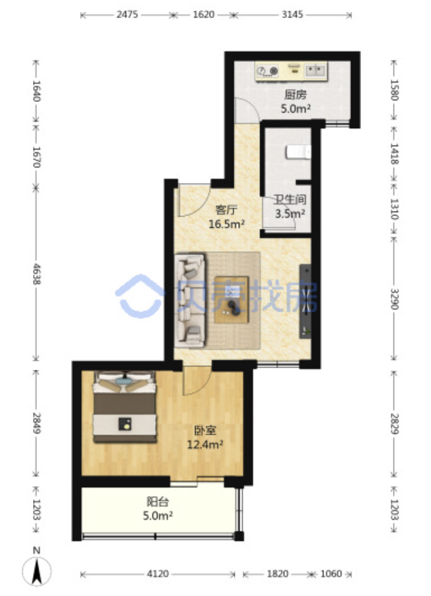
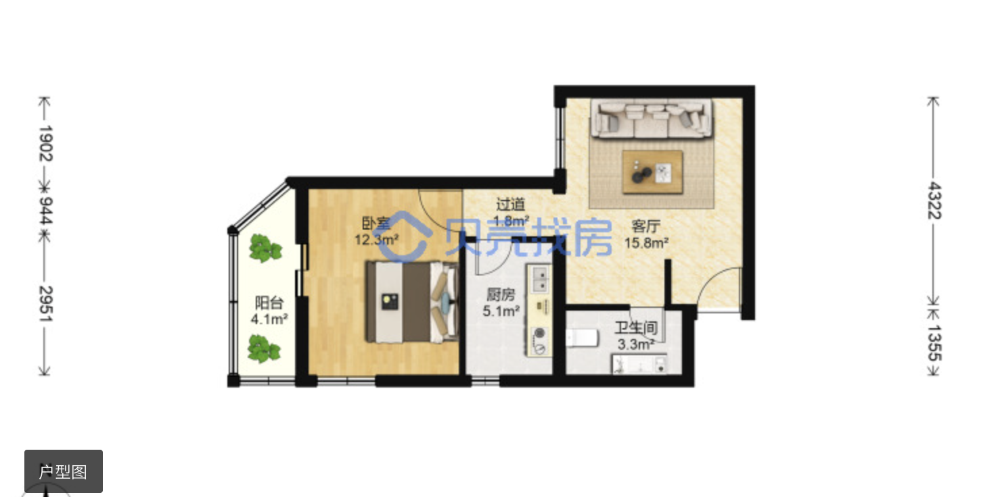

|  小区   |  建筑年代 | 建筑类型 |楼栋总数|
|  ----  | ----  |----  |----  |
| 牛街西里  | 1999 |塔楼 |14 |
| 单元格  | 单元格 |

|  小区   | 总价 | 建筑面积 |套内面积 |单价| 税费合计|户型 | 楼层 | 朝向 |链接| 户型图 | 
|  ----  | ----  |----  |---- |---- |---- |----   |----  |----  |----  |----  |
| 牛街西里 | 596  |57.67|\| 103347| 11.4 |1室1厅| ⾼楼层共19层|东 南|https://bj.ke.com/ershoufang/101112773349.html?fb_expo_id=486213554082254853||
| 牛街西里 | 518   |54.73|\| 94647| 4.9 |1室1厅| 中楼层共19层|南|https://bj.ke.com/ershoufang/101106094177.html?fb_expo_id=486212682925117442||
| 牛街西里 | 608   |57.67| 37.89|105428| 5.9 |1室1厅| 中楼层共19层|西南|https://bj.ke.com/ershoufang/101112507405.html?fb_expo_id=486213554082254850||

