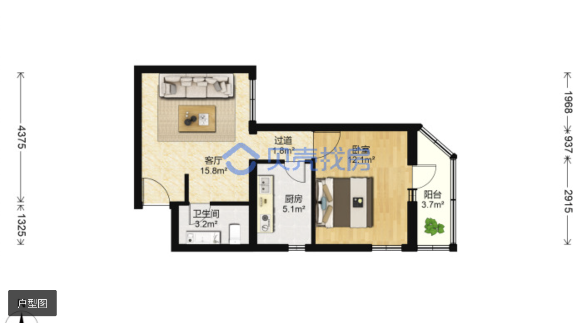

|  小区   |  建筑年代 | 建筑类型 |楼栋总数|
|  ----  | ----  |----  |----  |
| 牛街西里  | 1999 |塔楼 |14 |
| 单元格  | 单元格 |

|  小区   | 总价 | 建筑面积 |单价| 户型 | 楼层 | 朝向 | 链接 | 户型图 | 
|  ----  | ----  |----  |---- |----   |----  |----  |----  |----  |
| 牛街西里 | 596  |57.67| 103347|1室1厅| ⾼楼层共19层|东 南|https://bj.ke.com/ershoufang/101112773349.html?fb_expo_id=486213554082254853||
| 单元格  | 单元格 |
